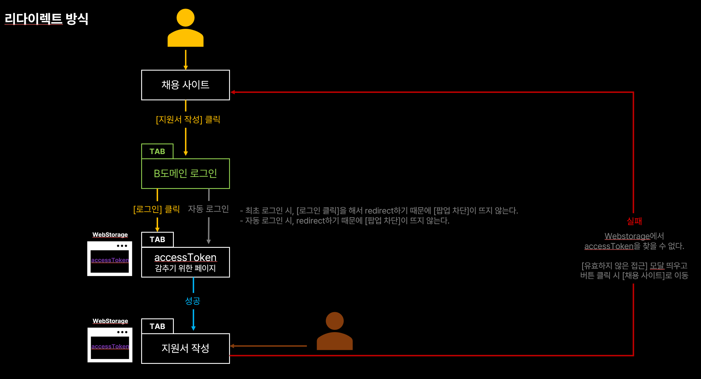

> 👨‍💻 회사에서 빠른 시간안에 해결해야 하는 일이 있었다. 현재 서비스에서 '지원하기' 버튼을 누르면 다른 도메인의 로그인 창이 열리고 거기서 로그인을 해야 지원서 작성을 할 수 있도록 만드는 일이었다. 일반적으로는 백엔드와 함께 작업했겠지만, 부족한 인력과 시간 속에서 프론트만으로 해결 가능한 방법을 강구했고 시도해보기로 했다. 나와 같은 상황에 처한 사람들이 시행착오로 많은 시간을 허비하지 않기를 바라면서 이 글을 작성한다.
>
> 참고로, 레거시 프로젝트라서 jquery로 설명하는 점은 나도 안타깝다..ㅠㅠ (시간 될 때마다 리액트로 조금씩 마이그레이션 중..)


## 목표

우리의 목표는 채용사이트에서 [지원서 작성]을 누르면 다른 도메인의 로그인 팝업창이 뜨게 되고 거기서 로그인해야 지원서 작성 페이지에 도달할 수 있게 하는 것이다.
(이해를 돕기 위해 예를 들어보자. 사람인에서 [지원서 작성]버튼을 누르면 새로 개발한 채용시스템(다른 도메인)에 로그인해야만 지원서 작성을 할 수 있는 형태로 계약이 나온 상황이다. **중간에 다른 사이트 로그인을 한번 더 해야 한다는 것**. 사용자 UX상에는 큰 불편함을 야기할 수 있지만 사업 쪽 입장에서는 신규 서비스에 구직자 풀을 생성하기 위해 현재와 같은 방식이 나왔다.)

## 요구조건

침착하고 요구 사항을 정리하자.

- [채용사이트 > B도메인 로그인 > 지원서 작성] 
  - [B도메인 로그인]은 팝업 형태로 떠야 한다.
  - [B도메인 로그인 팝업]에서 로그인을 성공했을 때는 [지원서 작성]페이지가 열려야 하고 [B도메인 로그인 팝업]은 닫혀야 한다.
  - [B도메인 로그인] 성공 시 채용사이트, 지원서 작성 도메인 쪽으로 accessToken을 받아와서 web storage에 저장해야 한다. 
  - [지원서 작성] 페이지로 바로 접근 시에는 [B도메인 로그인 팝업]을 건너 뛰고 들어왔기 때문에 [채용 사이트]로 돌려보낸다.
  - [지원서 작성] 페이지에서 url에 쿼리가 없는 상태(즉, 어떤 공고인지 모르는 상태)일 때는 공고를 선택할 수 있어야 하며, 선택하면 [B도메인 로그인 팝업]에서 로그인을 했을 때 [B도메인 팝업]이 종료되고 message를 받아온 뒤 사용자 정보가 자동으로 입력된다.

>  요구 조건을 정리했을 때는 금방 개발이 끝날 줄 알았다. 이는 큰 착오였다.


## 시행착오

### 첫 번째 시도

첫 번째로 생각하고 시도한 방법은 이렇다.


1. [채용 사이트]에서 [지원서 작성]을 클릭한다.
2. [B도메인 로그인] 팝업 창이 뜨고 로그인 성공 시 로그인을 성공했다는 message를 부모인 [채용사이트]에게 전달한다.
3. [채용 사이트]에서는 메세지를 받을 때까지 기다리고 있다가 message를 받으면 [B도메인 로그인]창을 종료하고 [지원서 작성]페이지를 연다.

```js
> 채용사이트
// [B도메인 로그인]팝업 창을 연다.
const bDomainPopup = window.open('...', '_blank')

window.addEventListener('message', (e) => {
    const {data: {accessToken}, origin} = e;
    if(origin !== '..') return;
    bDomainPopup.close();
    sessionStorage.setItem('accessToken', accessToken);	
})

> [B도메인]
if(로그인 성공 시) {
    window.opener.postMessage()
}
```


### 결과

문제는 [채용 사이트]에서 사용자가 [지원서 작성]을 눌렀을 때 [B도메인 로그인]팝업 창을 여는데 까지는 사용자의 의도에 의해서 오픈 한 것이 맞으나, 로그인 성공 후 메세지를 받고 [지원서 작성]페이지를 여는 순간 사용자의 의도가 아니기 때문에 <u>브라우저 팝업 차단</u>이 걸리게 된다. 팝업 차단을 찾지 못하는 사용자를 위해서 팝업 차단이 걸렸을 때 팝업 차단을 해제해달라는 모달 창이 뜨는 조건도 추가해주었다.

```js
const resumePopup = window.open($(this).data('link'));
if(!resumePopup) {
    Alert('지원서 작성을 위해서는 팝업 해제가 필요합니다.\n' +
          '브라우저 우측 상단에서 팝업을 허용해 주세요.');
}
```

>  하지만, 출시 직전.. 팝업 차단을 아예 빼달라는 요청이 오게된다. 


### 두 번째 시도

우리의 목표는 팝업 차단이 뜨지 않는 것이다.
[B도메인 로그인]팝업 창에서 성공 시 채용사이트의 js코드에서 [지원서 작성]페이지를 새로 열어주려고 하며 팝업 차단이 일어나니 [채용사이트]에서는 [B도메인 로그인]창 까지만 띄워주고 [B도메인 로그인]창에서 [지원서 작성]페이지를 새로 띄워준다면 성공할 것 같았다.


1. [채용 사이트]에서 [지원서 작성]을 클릭한다.
2. [B도메인 로그인] 팝업 창이 뜨고 로그인 성공 시 지원서 작성 페이지를 오픈 한다.
3. [지원서 작성]페이지에서 페이지가 열렸을 때 [B도메인 로그인] 팝업 창으로 accessToken을 요청한다.
4. [B도메인 로그인] 팝업 창에서 [지원서 작성]페이지로 accessToken을 메세지로 보낸다.
5. [지원서 작성] 페이지에서 accessToken을 받았다면 부모 창인 [B도메인 로그인]창을 종료하고 accessToken을 이용해서 사용자 정보를 조회한다.

```js
> 채용사이트
window.open('', '_blank');

> B도메인 로그인
if(로그인 성공 시) {
    newPage = window.open('');
}
window.addEventListener('message', (e) => {
    const {data, origin} = e;
    if(origin !== '..') return;
    newPage.postMessage(accessToken, originUrl);
})

> 지원서 작성
window.opener.postMessage('im open! give me accessToken!', originUrl);
window.addEventListener('message', (e) => {
    const {data: {accessToken}, origin} = e;
    if(origin !== '..') return;
    sessionStorage.setItem('accessToken', accessToken);	
    window.opener.close();
})
```

> 사실 이 두번째 방법과 비슷하게 다양한 방법을 시도했다. 대표적으로는 [B도메인 로그인] 팝업 창에서 [지원서 작성]창을 띄우면서 바로 [B도메인 로그인] 팝업을 종료하는 방법을 시도했는데, 이건 B도메인 로그인 팝업창을 스스로 끌 수 없었다. 네이버를 키고 브라우저 개발자 도구에서 서로 다른 도메인으로 부모에서 자식 브라우저를 키고 또 킨 상태에서 첫번째 자식이 스스로 window.close()했을 때 잘 꺼졌는데.. 서비스에서 왜 꺼지지 않는지 이유는 아직도 이해할 수 없다. 요즘 팝업을 잘 사용하지 않아서 인지 원하는 정보를 찾을 수는 없었다.


### 결과

B도메인에서 로그인했을 때 자동 로그인이 되고 꺼지는 부분을 망각했다. 이 때는 [로그인]버튼을 누르지 않았기 때문에 자동으로 [지원서 작성]페이지를 띄우는 것에 대해 브라우저가 차단하는 것이었다.


### 세 번째 시도

리다이렉트 방식을 이용한다. 이 때 [B도메인 로그인] 팝업 창에서 accessToken을 받아서 채용사이트/지원서 작성 도메인의 WebStorage에 저장해야 한다는 점이 중요하다. 이를 위해서는 url에 포함하여 전달하는 방법밖에 없다. 이 때 당시 accessToken을 url에 포함하면 보안 상 위험하다는 생각을 했고 중간에 페이지를 하나 추가하는 방안을 생각했다. accessToken을 중간 페이지가 url로 받은 뒤 webstorage에 보관해주는 역할만 하는 것이다.



### 결과

결론부터 말하면, accessToken을 url에 그대로 노출시키로 했고 보안 상 위험하지 않다는 것을 알았다. 그래서 중간 페이지가 없어졌고 아주 간단한 로직으로 이루어졌다.

1. [채용사이트]에서 window.open을 이용하여 [B도메인 로그인] 창을 연다. 이 때 **새 창이 아니고 새 탭으로 연다.**
2. [B도메인 로그인]에서 로그인에 성공하면 router.push를 이용해서 [지원서 작성]페이지로 리다이렉트 된다.
   이 때 accessToken을 전달하기 위해 url 쿼리에 포함하여 전달한다.
3. [지원서 작성]페이지에서는 url에 포함된 accessToken을 읽어서 api를 호출한다.


### 기타 시도

- form방식을 이용해서 [B도메인 로그인]팝업에서 [지원서 작성]창을 띄우는 것도 해봤다. 기본적으로 팝업차단이 걸렸고, 다른 도메인이라서 안전하지 않은 페이지라고 브라우저에서 막더라. 다른 도메인일 때 form방식으로 새 창을 여는 것은 좋지 않다.


## 후기

- 이번에 플라우차트를 그리고 의견을 팀원들, 기획팀에게 공유하고 개발을 시작 했었는데 모두 너무 좋아해주었다. 역시 시각적인 자료가 이해에 도움이 많이 되는 듯 하다. 특히 이번 경우와 같이 다양한 것을 고려해야 할 때는 빛을 발하는 것 같다. 위에 정리한 내용은 핵심 요약만 해서 그렇지 실제로는 전달하고 받아야 할 데이터들과 고려해야 되는 부분들이 더 많았다.

- 이번에 정리하면서 놓친 점을 알게 되었다. 바로 지원서 작성 도중 이뤄지는 로그아웃이다. 역시 정리하는 습관은 좋다.

- [채용사이트]에서 [지원서 작성]으로 접근해야 하는 경우를 제외하고 [지원서 작성]으로 바로 진입하면 공고에 따라 [B도메인 로그인]을 해야하는 공고가 있고 아닌 공고가 있다. 그래서 이 때는 첫 번째 도전에서 사용했었던 로직 그대로 해서 리다이렉트가 아니고 [B도메인 로그인] 새 팝업 창이 열리고 닫히는 식으로 구현했다.

- message 이벤트, window api인 open, opener에 대한 것들을 빠삭하게 공부한 시간이었다.
- 지레짐작 하는 것은 개발하면서 정말 좋지 않은 태도다. 당연한 것은 없다. 그런데, 이번에 개발할 때 accessToken을 당연하게 url에 노출하면 안된다고 생각을 했고, 그 태도가 결과적으로는 개발 시간을 더 늦추는 계기가 되었다. 모든지 의심하고 궁금해하고 확실히 하나씩 집고 넘어가야 한다. 개발을 시작하면서 이런 태도를 항상 가지고자 하지만, 시간이 긴박해서인지 성급한 판단을 내렸다. 가장 빠른 길은 돌아가는 길이란 것을 명심하자.

- 요즘 팝업을 쓰지 않는 이유는 인앱브라우저에서 동작하지 않는 경우들도 있고, 핸드폰에서 팝업이 주는 사용자 경험이 떨어지기 때문이다. 해당 서비스는 웹만 제공하기 때문에 팝업이 처음에 기획 단계에서 고려되었다.
- 서로 다른 domain은 web storage를 공유하지 못한다.
