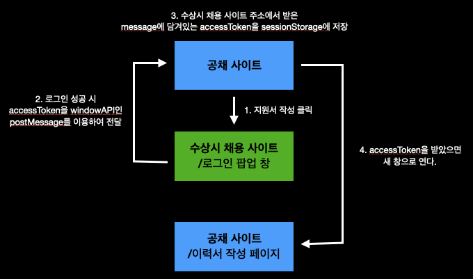
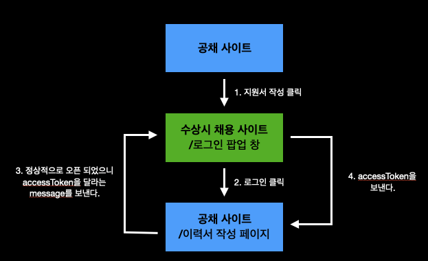
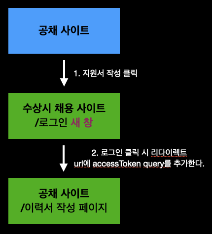

> 👨‍💻 **이 글을 작성한 이유**
> 나는 현재 회사에서 공채 서비스를 개발하고 있다. 회사 내 신규 서비스인 수상시 채용 서비스가 개발되면서 구직자들이 필요하게 되었는데, 이를 위해 공채 사이트에서 지원하려고 할 때 수상시 채용 서비스 팝업창이 뜨면서 강제 로그인을 해야 하는 과정이 추가 되었다. 이 때 주고받아야 하는 데이터들이 있었고 로그인 성공했을 때 팝업 창을 종료하고 기존 페이지는 그대로 진행될 수 있게 하는 등 다양한 요구조건이 생겼다.
>
> 그런데, 요즘 웹 트렌드에서는 팝업을 사용하지 않기 때문에 정보를 찾기 어려웠다. 그래서 시행착오에 굉장히 많은 시간을 소모했고, 이 글은 그 때를 기억하며 혹시 나와 비슷한 경우 이 글을 찾으면 조금이나마 도움을 줄 수 있을 것 같아서 작성했다.

## 목표

우리의 목표는 공채 사이트에서 `지원서 작성`을 누르면 다른 도메인의 로그인 팝업창이 뜨게 되고 거기서 로그인해야 지원서 작성 페이지에 도달할 수 있게 하는 것이다.

## 요구조건

- `공채 사이트`에서 `지원서 작성`을 눌렀을 때 `수상시 채용 서비스 로그인 창`은 팝업 형태로 떠야 한다.
  (추후에 팝업이 아닌 새 창으로 열리고 그 **새창에서 공채 사이트의 이력서 페이지를 redirect하는 식으로** 바뀌게 된다. 이유는 브라우저의 팝업 차단 때문이다..)
- `수상시 채용 서비스 로그인 창`에서 로그인 성공 시 지원서를 작성할 수 있는 `이력서 페이지`가 열리면서 수상시 채용 서비스에 API를 요청해서 회원 정보를 받아야 함으로 accessToken을 전달받아야 하고 이 때 `로그인 팝업 창`은 닫혀야 한다.
  (이 요구사항 역시, 팝업 차단의 문제가 있어서 redirect하는 식으로 바뀌었고 accessToken을 query에 넣어 전달하는 형식으로 바꿨다. 그리고 일반적으로 공채 서비스 쪽 백엔드를 거쳐서 수상시 채용 서비스쪽 백엔드로 요청하는 것이 맞으나, 이 때 당시 잦은 기획 변경으로 촌각을 다투고 있는 상황이었기에 불가피했다.)
- `이력서 페이지`로 다이렉트로 접근 시 `공채 사이트`로 돌려보낸다.
- `이력서 페이지`에서 쿼리가 없을 경우에는 어떤 공고인지 모르는 상태기 때문에 공고 SelectBox에서 공고를 선택할 수 있어야 하며, 공고를 선택하면 `수상시 채용 서비스 로그인 창` 이 팝업 창으로 열리고 로그인 성공 시 팝업 창이 종료되면서 사용자 정보를 받아온다. (첫번째 요구조건에서는 추후 새 창으로 뜨도록 방향을 바꿨지만, 이 요구사항의 경우에는 현재 페이지를 유지해야하기 때문에 팝업 창을 사용했다.)

## 시행착오

이 글에서는 첫번째, 두번째 요구사항을 기준으로 설명하려 한다.

### 첫 번째 시도

기획이 바뀌기 전 첫 번째로 생각하고 시도한 방법은 이렇다.



```js
// 공채 사이트
const loginPopup = window.open('...', '_blank')

window.addEventListener('message', (e) => {
  const {data: {accessToken}, origin} = e;
  if(origin !== '..') return;
  
  loginPopup.close();
  sessionStorage.setItem('accessToken', accessToken);	
})
```

```js
// 수상시 채용 사이트
if(로그인 성공 시) {
    window.opener.postMessage()
}
```


### 결과

문제는 위 그림에서 `4.accessToken을 받았을 때 새 창으로 열 때 발생`했다. 로그인 성공 후 메세지를 받고 [지원서 작성]페이지를 여는 순간 사용자의 행위에 의해 동작하는 것이 아니라 스크립트가 동작해서 여는 것이기 때문에 `브라우저 팝업 차단`이 걸리게 됐다.. 그래서 팝업 차단을 찾지 못하는 사용자를 위해서 팝업 차단이 걸렸을 때 팝업 차단을 해제해달라는 모달 창이 뜨는 조건도 추가해주었다.

```js
const resumePopup = window.open($(this).data('link'));
if(!resumePopup) {
  Alert('지원서 작성을 위해서는 팝업 해제가 필요합니다.\n' +
  '브라우저 우측 상단에서 팝업을 허용해 주세요.');
}
```

>  하지만, 출시 직전 팝업 차단을 아예 빼달라는 요청이 오게된다. 


### 두 번째 시도

`수상시 채용 사이트`에서 로그인 성공 시 `공채 사이트`에서 스크립트에 의해 `이력서 작성 페이지`를 열어주는 것이 안되기 때문에 `수상시 채용 사이트 로그인 창`에서 로그인을 클릭했을 때 `이력서 작성 페이지`를 열어주는 방법을 시도해봤다.



```js
// 공채 사이트
window.open('', '_blank');
```

```js
// 수상시 채용 사이트
if(로그인 성공 시) {
  newPage = window.open('');
}
window.addEventListener('message', (e) => {
  const {data, origin} = e;
  if(origin !== '..') return;
  newPage.postMessage(accessToken, originUrl);
})
```

```js
// 공채 사이트 - 이력서 작성 페이지
window.opener.postMessage('im open! give me accessToken!', originUrl);
window.addEventListener('message', (e) => {
  const {data: {accessToken}, origin} = e;
  if(origin !== '..') return;
  sessionStorage.setItem('accessToken', accessToken);	
  window.opener.close();
})
```


### 결과

정상적으로 동작할 것으로 예상했다. 물론 첫번째 로그인 시에는 정상적으로 동작했다. 하지만, 이미 로그인 한 상태일 때 `공채사이트`에서 `지원하기`를 누르면 자동 로그인이 되어 결국 팝업 차단이 걸리게 되었다.
(팝업 차단이 이제는 `수상시 채용 사이트 로그인 팝업창`에서 뜨는 꼴이 되버린 셈..)

이 부분에서 난관이 많았다. 정말 다양한 시도를 해봤다.(form 방식으로 열어주는 것도 시도해봤다.) 하지만, 브라우저마다 부모창과 자식창을 제어하는 방법도 다르고 교차출처로 인해 어느 방향이냐에 따라 되기도하고 안되기도 했다. 그래서 결국 실패를 맛봤다. 팝업창은 UX를 위해서도 지양해야 하지만, 정말 많은 문제를 안고있다는 것을 이 때 뼈저리게 깨달았다.

> 많은 개발자와 대화해봤지만, 현 시대에 팝업을 사용해 본 Front개발자가 적을 뿐더러 교차출처일 때 정보를 교환하고 제어해 본 Front 개발자는 찾을 수 없었다. 사용자 UX를 해치지 않으면서 더 좋은 방법은 없을까?


### 세 번째 시도

이번에는 리다이렉트 방식을 이용한다. 이제는 수상시 채용 사이트가 작게 열리는 팝업 형태가 아니라 크게 새 창으로 열려야 한다. 이 때 수상시 채용 사이트에서는 accessToken을 이력서 작성 페이지로 보내줘야 하는데 다른 도메인이기 때문에 WebStorage를 사용할 수는 없었고, 이를 위해서는 uri에 포함하여 전달하는 방법밖에 없다. 




### 결과

성공했다. accessToken을 URI에 포함하다보니 일단.. 좋아보이지는 않지만 보안상에 문제없음을 확인했다.


## 후기

- 이번 기회로 처음에 기획안이 나왔을 때 처음부터 기획 그대로 하는 것이 아니라 시작 전에 다양한 설계 방향을 생각해보면 결과적으로 시간도 더 아끼고 좋은 UX를 고려할 수 있겠다는 생각을 했다.

- 위에 정리한 글과 그림들은 극히 일부의 정보다. 실제로는 훨씬 복잡했기 때문에 10페이지가 넘는 경우의 수를 플로우차트로 그리면서 개발을 했다. 기획 쪽에 간단하게 진행상황을 공유할 때나 개발자들과 얘기할 때도 플로우차트가 큰 도움을 줬다. 이번 경우와 같이 다양한 것을 고려해야 할 때는 빛을 발휘하는 것 같다.

- 팝업은 모바일에서 데스크탑뿐만 아니라 모바일에서도 사용자 경험이 좋지 않다. ~~개발자 경험도 좋지 않다.~~ 인앱브라우저에서 동작하지 않는 경우들도 있다. 이번 개발은 PC만 고려했기에 팝업이 고려되었다. 
- 지레짐작 하는 것은 개발하면서 정말 좋지 않은 태도다. 당연한 것은 없다. 그런데, 이번에 개발할 때 accessToken을 당연하게 url에 노출하면 안된다고 생각을 했고, 그 태도가 결과적으로는 개발 시간을 더 늦추는 계기가 되었다. 모든지 의심하고 궁금해하고 확실히 하나씩 집고 넘어가야 한다. 개발을 시작하면서 이런 태도를 항상 가지고자 하지만, 시간이 긴박해서인지 성급한 판단을 내렸다. 가장 빠른 길은 돌아가는 길이란 것을 명심하자.


# 추가로 읽어보면 좋을 글

[출처가 다른 윈도우 간에는 데이터를 어떻게 통신할까?](https://ui.toast.com/posts/ko_20220831)

