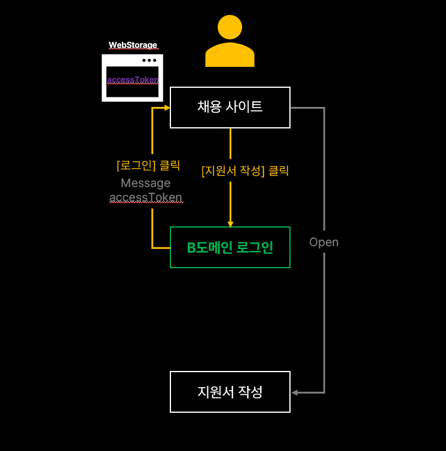
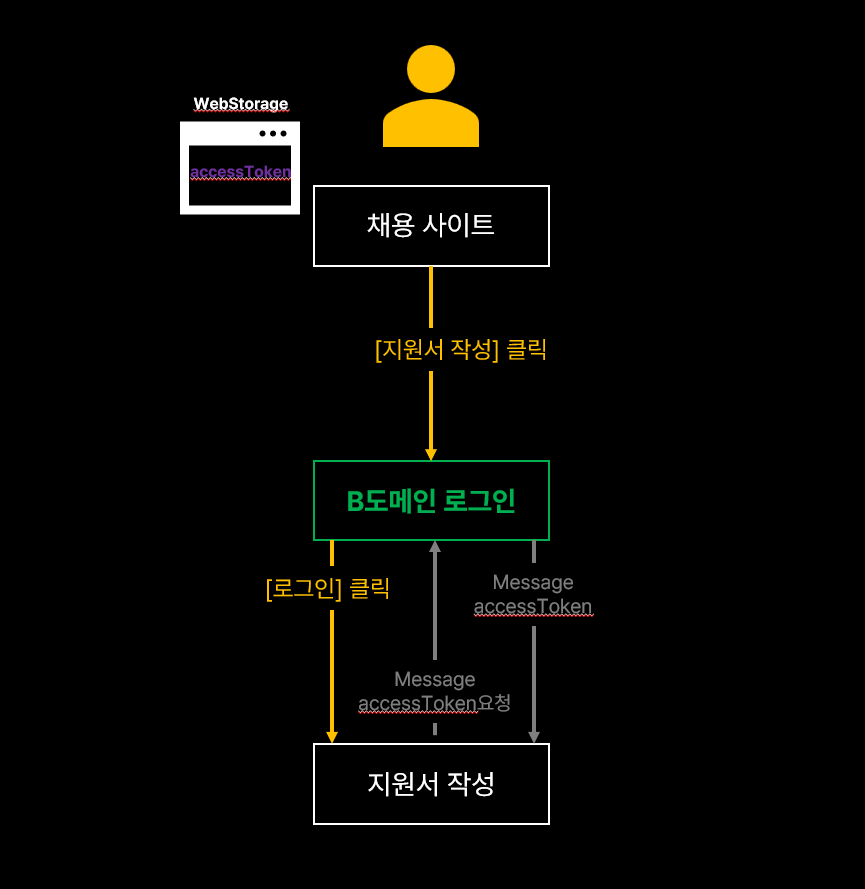

> 👨‍💻 회사에서 빠른 시간안에 해결해야 하는 일이 있었다. 현재 서비스에서 '지원하기' 버튼을 누르면 다른 도메인의 로그인 창이 열리고 거기서 로그인을 해야 현재 서비스를 이어서 할 수 있도록 만드는 일이었다. 부족한 시간 속에서 프론트끼리만 해결해야 하는 상황이었다. 그래서, 브라우저가 내장하고 있는 window api인 postMessage메서드를 이용하여 현재 창을 열게 한 부모 창이나, 자식 창에게 메세지를 보내려고 시도해보았다. 나와 같은 경우가 있는 사람들은 시행착오로 많은 시간을 허비하지 않기를 바라면서 이 글을 작성한다.
>
> 참고로, 레거시 프로젝트라서 jquery로 설명하는 점은 나도 안타깝다..ㅠㅠ (시간 될 때마다 리액트로 조금씩 마이그레이션중..)


## 목표

우리의 목표는 채용사이트에서 [지원서 작성]을 누르면 다른 도메인의 로그인 팝업창이 뜨게 되고 거기서 로그인해야 지원서 작성 페이지에 도달할 수 있게 하는 것이다.
(이해를 돕기 위해 예를 들어보자. 사람인에서 [지원서 작성]버튼을 누르면 새로 개발한 채용시스템(다른 도메인)에 로그인해야만 지원서 작성을 할 수 있는 형태로 계약이 나온 상황이다. **중간에 다른 사이트 로그인을 한번 더 해야 한다는 것**. 사용자 UX상에는 큰 불편함을 야기할 수 있지만 사업 쪽 입장에서는 신규 서비스에 구직자 풀을 생성하기 위해 현재와 같은 방식이 나왔다.)

## 요구조건

침착하고 요구 조건을 정리하자.

- [채용사이트 > B도메인 로그인 > 지원서 작성] 
  - B도메인 창은 팝업 형태로 떠야 한다.
  - B도메인 로그인 팝업에서 로그인을 성공했을 때는 [지원서 작성]페이지가 열려야 하고 B도메인 로그인 팝업은 닫혀야 한다.
- B도메인 로그인 성공 시
  - accessToken을 web storage에 저장해야 한다.
  - [지원서 작성] 페이지로 바로 접근 시 accessToken이 없기 때문에 접근 불가 창이 뜨면서 페이지 접속을 차단한다.
  - accessToken이 있다면 [지원서 작성]페이지에서 B도메인에게 사용자 이름, 이메일, 전화번호를 받아온다.

>  요구 조건만 보면 굉장히 간단해서 하루면 개발이 끝날 줄 알았다. 이는 큰 착오였다.


## 시행착오

### 첫 번째 시도

첫 번째로 생각하고 시도한 방법은 이렇다.



1. [채용 사이트]에서 [지원서 작성]을 클릭한다.
2. [B도메인 로그인] 팝업 창이 뜨고 로그인 성공 시 로그인을 성공했다는 message를 부모인 [채용사이트]에게 전달한다.
3. [채용 사이트]에서는 메세지를 받을 때까지 기다리고 있다가 message를 받으면 [B도메인 로그인]창을 종료하고 [지원서 작성]페이지를 연다.

```js
const jobdaLoginMessageFn = (event) => {
    if(event.origin === jobdaDomain) {
        const {data: {accessToken}} = event;
        if(accessToken) {
            jobdaLoginPopup.close();
            sessionStorage.setItem('accessToken', accessToken);
            window.open($(this).data('link'));
            }
        }
    }
}
window.addEventListener('message', jobdaLoginMessageFn, {once: true});
```

> 이론 상으로 완벽(?)해 보였다..

### 결과

문제는 [채용 사이트]에서 사용자가 [지원서 작성]을 눌렀을 때 [B도메인 로그인]팝업 창을 여는데 까지는 사용자의 의도에 의해서 오픈 한 것이 맞으나, 로그인 성공 후 메세지를 받고 [지원서 작성]페이지를 여는 순간 사용자의 의도가 아닌 script로 여는 것이기 때문에 <u>브라우저 팝업 차단</u>이 걸리게 된다. 팝업 차단을 찾지 못하는 사용자를 위해서 팝업 차단이 걸렸을 때 팝업 차단을 해제해달라는 모달 창이 뜨는 조건도 추가해주었다.

```js
const resumePopup = window.open($(this).data('link'));
if(!resumePopup) {
    Alert('지원서 작성을 위해서는 팝업 해제가 필요합니다.\n' +
          '브라우저 우측 상단에서 팝업을 허용해 주세요.');
}
```

>  하지만, 몇 달 뒤 팝압 차단으로 인해 다른 방법을 시도한다.


### 두 번째 시도

채용사이트에서 두 가지 일을 하는 것은 팝업 차단이 일어나니, 한 가지 일을 각자의 도메인에서 수행하면 될 것 같았다.



1. [채용 사이트]에서 [지원서 작성]을 클릭한다.
2. [B도메인 로그인] 팝업 창이 뜨고 로그인 성공 시 지원서 작성 페이지를 오픈 한다.
3. [지원서 작성]페이지에서 페이지가 열렸을 때 [B도메인 로그인] 팝업 창으로 accessToken을 요청한다.
4. [B도메인 로그인] 팝업 창에서 accessToken을 메세지로 보낸다.
5. [지원서 작성] 페이지에서 accessToken을 받았다면 부모 창인 [B도메인 로그인]창을 종료하고 사용자 정보를 조회한다.

> 이 flow 또한 복잡하긴 하지만 가능할 것 같다고 생각했다.

### 결과

