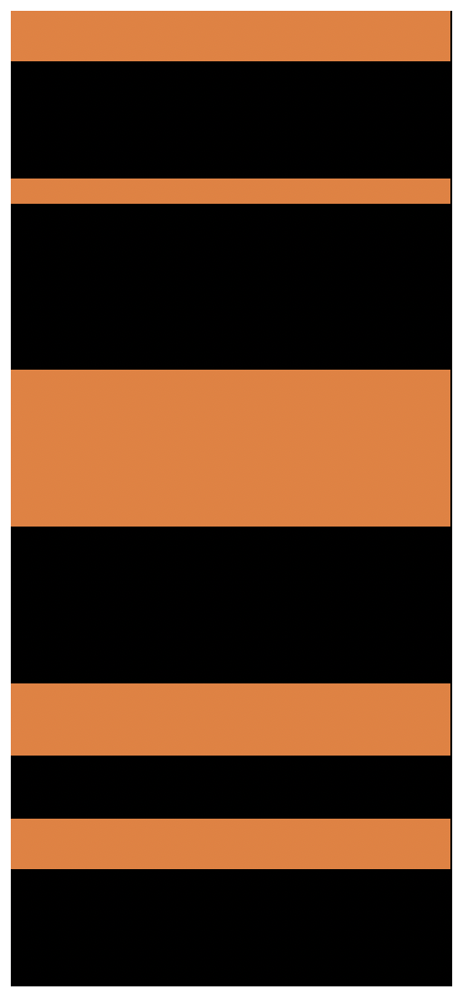

## 상황

수상시 채용 서비스가 출시되었다.

기존에 있었던 채용 서비스의 회원들을 수상시 쪽으로 유도하기 위해 공고 지원서 작성 페이지 진입 시 수상시 서비스의 로그인 페이지를 넣기로 결정되었다.

강제로 중간 프로세스를 끼워넣어야 하는데 몇 천줄이 넘는 코드 중간중간에 소스를 삽입하면서 유지보수가 어려워지고 사이드가 발생할 확률이 굉장히 높은 상황이다.


## 문제 정의

문제를 다시한번 정리해보자.

- 고객사 반응에 따라 배포 후 롤백을 고려하거나 부분적인 수정이 단기간에 잦은 수정할 가능성이 높다.
- 방대한 코드량 및 복잡도가 높은 코드 사이에 넣어야 하고, 지원서 작성으로 이어지는 모든 페이지 중간에 넣어야 하기 때문에 사이드 가능성이 높다.
- 이 길고 긴 파일에서 전역 변수는 최상단에 선언되어있다. 즉, 전역 Scope가 오염되어 있다.

만약, 기존 소스코드 형식에 융화시키자면 아래와 같은 모습이 될 것이다.

최상단에 전역변수를 선언해주고 전역 객체 내부에 메서드 형식으로 UI 메서드, 비즈니스 로직 메서드를 만들어주고 필요한 곳에서 호출해야 한다.
딱 봐도 동료 개발자가 소스코드를 파악하기 위한 동선이 너무 길다.

(주황색은 새로운 서비스를 연동하기 위해 추가한 코드이고 검정색은 기존 코드들이다.)




 

## 해결 방향

신규 서비스와 연동하는데 필요한 변수들과 함수들을 기존 코드와 격리시키고 객체명만 보고도 어떤 기능들을 가지고 있는지 알면 좋겠다라고 생각했다. 그래서 클로저 패턴을 사용했다. 기존에 있던 로직들 사이에서는 클로저가 반환하는 함수만 사용하는 것이다. 이렇게 하면 기존 오래된 서비스 로직을 파악할 때는 새로운 서비스에서 사용되고 있는 로직들을 파악할 필요가 없다. 즉, 클로저 내부에서 어떤 변수가 사용되고, 어떻게 동작하는지 알 필요가 없다. 만약, 새로운 서비스와 연동하는데에서 발생한 문제라면 모듈화한 클로저 속에서 어떤 로직의 문제일 것이니 찾기도 쉬울 것이다. 그림으로 보면 아래와 같은 모습일 것이다.


## 코드

간단하게 축약한 코드로 살펴보면 다음과 같다. jobdaFn(신규 수상시 서비스 이름이 jobda다)에서는 `init`함수와 `openJobdaLoginPopupAndLoadProfile`함수만 내보내서 필요한 곳에서 사용하고 있다. 이로서 신규 서비스와 관련된 로직을 파악할 때는 이곳만 보면 한눈에 로직을 파악할 수 있다.

```js
let RegistResume = (function() {
	let fn, keyData, recruitNoticeList = [], targetRecruitNotice = {}, paramData = {}, interval, modalAgreement = { canMoveNextStep: false }, blockEmailData, jfYn, jdYn;

	keyData = {
		// 수 많은 키와 값들..
	};

	paramData = {
		// 수 많은 키와 값들..
	};

	blockEmailData = ...

	/**
	 * JF3 계약 공고 시 지원서 작성 창에서 동작해야 할 로직들을 응집도있게 모아놨다.
	 * @type {{init(number): void, openJobdaLoginPopupAndLoadProfile(): void}}
	 */
	const jobdaFn = (() => {
		let isJobda = false;
		const urlParmas = new URLSearchParams(window.location.href);
		const accessToken = urlParmas.get('accessToken');

		const checkJobda = () => {
			$.ajax({
				type: 'get', dataType: 'json',
				url: ...,
				async : false,
			}).done(function(contractType, e) {
				isJobda = contractType === 'JOBDA';
				jdYn = contractType === 'JOBDA';
			});
		}
		
		const checkDirectEnter = () => {
			Common.modal({
				title : '올바르지 않은 방식의 접근',
				width : '500',
				height : '226',
				btnTitle : '채용사이트 공고로 돌아가기',
				enabledConfirm : false,
				enabledCancel : false,
				enabledCancelConfirm : false,
				btnEvent() {
					window.location.href = `${window.location.origin}/app/jobnotice/view?systemKindCode=MRS2&jobnoticeSn=${keyData.jobnoticeSn}`;
				},
				content : (function() {
					let t = [];
					t.push('<div style="font-size:14px;text-align:center">올바르지 않은 방식으로 접근하여 페이지를 찾을 수 없습니다.<br>정상적인 방법으로 다시 시도해 주세요.</div>');
					return t.join('');
				})()
			});
			return;
		}

		const loadJobdaUserProfile = (accessToken, jobnoticeSn) => {
			const jobdaApiDomain = $('#jobdaApiDomain').val();

			const param = {
				recruitNoticeSn: jobnoticeSn,
				accessToken: accessToken,
			}

			$.ajax({
				type: 'POST',
				dataType: 'json',
				beforeSend: Common.loading.show(),
				url: `...`,
				async: false,
				data: param,
			}).always(Common.loading.countHide).fail(Common.ajaxOnfail)
				.done(function(data, e) {
					const { name, email, mobile = '', certificated: isCertificated } = data;

					// 사용자 정보 DOM에 삽입
					$('#name').val(name);
					$('#mobile1').val(mobile?.slice(0, 3));
					$('#mobile2').val(mobile?.slice(3, 7));
					$('#mobile3').val(mobile?.slice(7));
					$('#email').val(email);
					$('#emailConfirm').val(email);
					$('#certificated').val(certificated.toString());

					// 사용자 정보 입력되고 나서 이름, 이메일 바로 유효성 검증.
					fn.checkName();
					fn.checkEmail();
					fn.checkConfirmFunc();
				});
		}

		return {
			init() {
				if (keyData.jobnoticeSn > 0 && keyData.recruitTypeCode !== 'RECOMMEND' && keyData.recruitTypeCode !== 'PRIVATE') {
					checkJobda();
				}

				if(isJobda) {
					// JF3 계약 시 생성된 공고인데 잡다 로그인 없이 url만으로 바로 들어왔을 때 채용사이트 공고로 다시 보낸다.
					if(!window.opener) {
						checkDirectEnter();
					}
					// 채용사이트를 통해 정상적으로 접근했다면, 잡다 정보를 넣는다.
					loadJobdaUserProfile(accessToken, keyData.jobnoticeSn);
				}
			},
			// 잡다 로그인 페이지를 열었다가 종료하며, 사용자 정보를 받아오고 input Element에 넣는다.
			openJobdaLoginPopupAndLoadProfile() {
				const messageUrl = window.location.href;
				const jobdaDomain = $('#jobdaDomain').val().trim();
				const PAGETYPE = 'mypage';

				const jobdaLogin = window.open(...);

				const jobdaLoginMessageFn = (event) => {
					if(event.origin === jobdaDomain) {
						if(event.data.isJobdaClose) {
							jobdaLogin.close();
						}
						if(event.data.accessToken) {
							jobdaLogin.close();
							loadJobdaUserProfile(event.data.accessToken);
						}
					}
				}
				window.addEventListener('message', jobdaLoginMessageFn, {once: true});
			}
		}
	})();

	fn = {
		init() {
			fn.load();
			fn.event();
			fn.privatePassword(); 
      
			jobdaFn.init();
		},
		load() {
			...
      jobdaFn.openJobdaLoginPopupAndLoadProfile();
		},
		event() {
      ...
    }
```


## 클로저 패턴으로 신규 서비스에 대한 로직을 관리한 후기

예상했듯이 배포 후 기획이 여러번 수정되었다. (이런 변수들을 사전에 고려하고 기획자와 충분한 대화를 하는 것도 개발자에게 중요한 자질 중 하나다.)

클로저 패턴을 사용해서 응집도 높게 모아둔 덕분에 금방금방 수정할 수 있었다. 애초에 이슈가 터졌다고 하더라도 걱정이 안됐다. 빠르게 파악할 수 있다는 믿음이 있었다. 생산성이 대폭 향상된 것이다.

레거시 프로젝트 특성상 이슈 처리가 쉽지 않은데 생산성 향상이 의미하는 바는 크다. 실제로 내가 휴가기간이었어서 직접 수정하기가 어려운 상황이 있었는데, 동료에게 소스 위치를 알려주었고, 금새 로직을 파악할 수 있었다고 한다.

생각해보면 레거시 프로젝트를 마이그레이션 하는 이유도, 생산성을 올리기 위한 것인데 당장 마이그레이션 하기 어려운 상황에서 적지 않은 프로세스를 끼어넣어야 하는 상황이라면 이런 식으로 Scope를 별도로 관리하는 방식을 추천한다.

